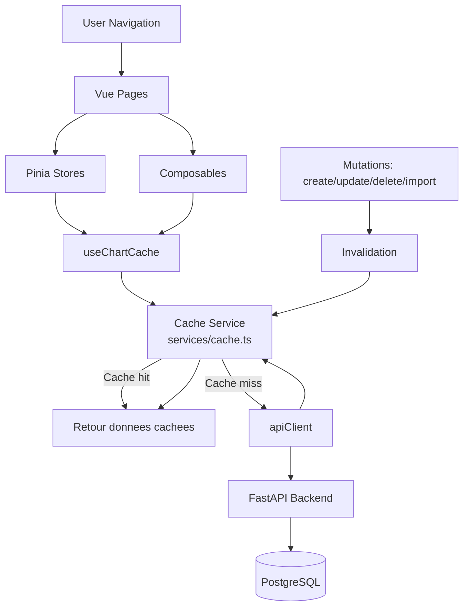
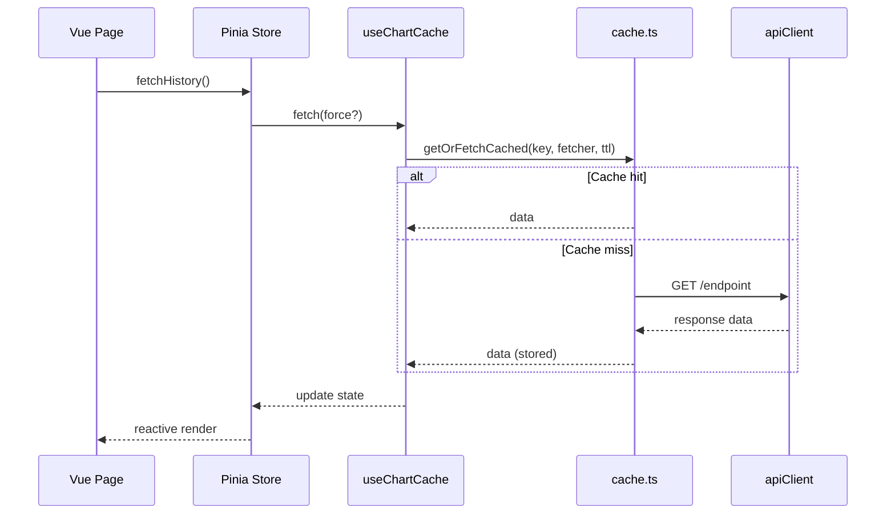

# Cache Architecture and Design Patterns

## Objectif

Ce document decrit le schema de cache frontend centralise et les design patterns utilises.

## Vue d'ensemble

## Pattern 1: Cache-Aside (Lazy Loading)

Principe:
1. Lire d'abord dans le cache global (par cle).
2. Si pas de donnee fraiche, appeler l'API.
3. Stocker le resultat en cache avec TTL.
4. Retourner la donnee.

Implementation:
- `getOrFetchCached(key, fetcher, ttlMs, force)` dans `services/cache.ts`.

## Pattern 2: Key-Based Cache

Chaque type de donnee a une cle stable:
- `dashboard:wealth-history`
- `bank:history:global`
- `bank:history:account:{accountId}`
- `asset:history:global`

Benefices:
- Isolation des domaines de donnees.
- Invalidation ciblee.
- Pas de collisions entre modules.

## Pattern 3: TTL Expiration

Le cache conserve `fetchedAt` + `ttlMs` par entree.
Une entree est valide si:

$$
Date.now() - fetchedAt < ttlMs
$$

Exemple courant:
- TTL = 1 heure pour les historiques peu volatils.

## Pattern 4: Request Coalescing (Dedup In-Flight)

Si plusieurs appels concurrentiels demandent la meme cle:
1. Un seul appel API est lance.
2. Les autres attendent la meme Promise.

But:
- Eviter la surcharge reseau lors des changements de page rapides.

## Pattern 5: Explicit Invalidation

Apres mutation, on invalide:
- Une cle unique: `invalidateCacheKey(key)`
- Un domaine: `invalidateCachePrefix(prefix)`

Cas utilises:
- Comptes banque: invalidation globale + par compte.
- Assets: invalidation historique global apres create/update/sell/delete.

## Pattern 6: Store + Composable Separation

- Les stores Pinia restent la facade metier pour les pages.
- `useChartCache` encapsule la logique transversale de cache.
- Le service `cache.ts` est le moteur commun reutilisable.

Cela suit une separation claire:
- UI orchestration -> pages
- Etat metier -> stores
- Infra cache -> service

## Diagramme de sequence

## Mapping Code

- Moteur global: `frontend/src/services/cache.ts`
- Composable cache: `frontend/src/composables/useChartCache.ts`
- Store patrimoine global: `frontend/src/stores/wealthHistory.ts`
- Store banque: `frontend/src/stores/bank.ts`
- Page assets (historique global): `frontend/src/pages/Asset.vue`

## Decision rationale

Pourquoi cette architecture est pertinente:
1. Une seule implementation de cache au lieu de N versions locales.
2. Invalidation maitrisable et explicite apres mutations.
3. Evolution facile: changement TTL/strategie en un point.
4. Meilleure robustesse face aux navigation rapides (dedup en vol).
